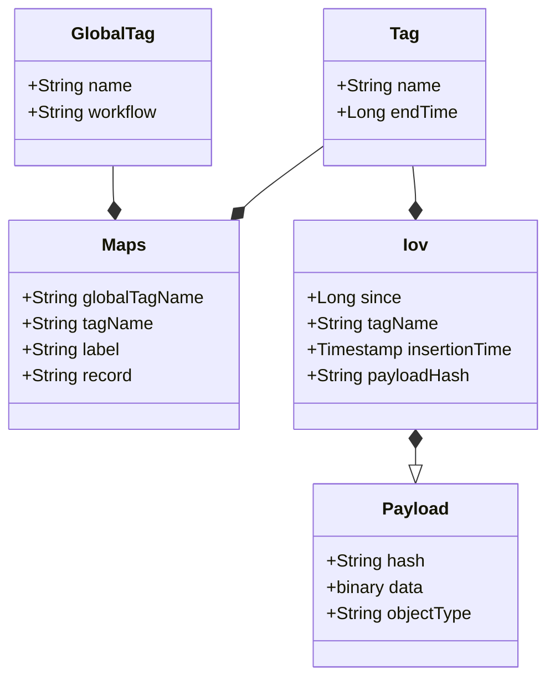
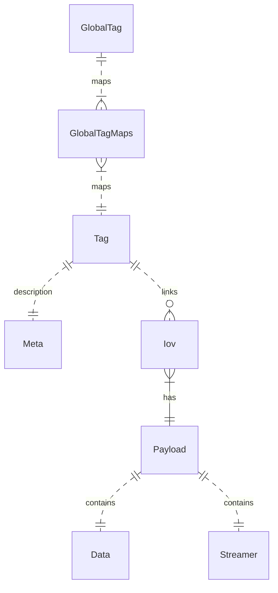

#### Author: A.Formica, R.Sipos
#### Contributors: M.Mineev, E.Alexandrov (client tools)
```
   Copyright (C) 2016  A.Formica, R.Sipos

    This program is free software: you can redistribute it and/or modify
    it under the terms of the GNU General Public License as published by
    the Free Software Foundation, either version 3 of the License, or
    (at your option) any later version.

    This program is distributed in the hope that it will be useful,
    but WITHOUT ANY WARRANTY; without even the implied warranty of
    MERCHANTABILITY or FITNESS FOR A PARTICULAR PURPOSE.  See the
    GNU General Public License for more details.

    You should have received a copy of the GNU General Public License
    along with this program.  If not, see <http://www.gnu.org/licenses/>.
```
# Table of Contents
1. [Description](#description)
2. [Data Model](#data-model-overview)
1. [Workflows](#workflows)

## Description
CREST service is a RESTful API for the storage and retrieval of IOVs (Interval of Validity) and payloads.
The data model is illustrated in the following diagram:



The entity relationship in the relational DB is represented in the following diagram:


## Data Model overview
1. `TAG` : a tag is a virtual container of metadata (the `IOVs`), and is defined via the following properties
    * `name` : a string identifying the tag in a unique way
    * `description` : a general description of the tag
    * `timeType` :  the time type of the tag [time, run-lumi,...]
    * `payloadSpec` : the type of the object that the tag is associated with (a CrestContainer can generate either `crest-json-single-iov`, or `crest-json-multi-iov`)
    * `synchronization` : the synchronization of the tag, this is still to be defined, but could be `UPDX` for example (optional, can be taken from tag name).
    * `lastValidatedTime`:  The last validated time of the tag, in millisecon (optional, not used in Athena).
    * `endOfValidity` : the end of validity of the tag, in the same units as the "since" of the IOVs (see later).
1. `TAGMETA` : this object has been introduced mainly to provide a correct mapping with the existing `metadata` of `COOL`, in particular related to `channels` list and `folder` specifications. It is in one-to-one relationship with the `TAG`. It is essential to have these metadata in order to increase compatibility with COOL related code in Athena. We will provide more details below on its content. For Athena usage, it is mandatory to create a TAGMETA entry for each TAG that a user create.

2. `IOV` : the metadata represeting the start of validity for a given payload. It is defined via the following properties
    * `tagName` : the name of the tag.
    * `since` : the since of the IOV.
    * `insertionTime` : the insertion time of the IOV. Provided by the server.
    * `payloadHash` : the unique key for the payload. It is computed as the SHA256 hash of the payload by the server.
      In CREST the concept of IOV is always *open-ended*, in the sense that it is valid until the next since. The only IOV for which we foresee a possible *end time* is the last IOV; when the *end time* is not INFINITY, then it can be provided during the PAYLOAD upload. It will update the *endOfValidity* field in the TAG table. Any search functionality will in any case only use the *since* field in CREST, and eventually the *insertionTime*. The latter is used to *go back* into the history of a given *since*, in the case that it has been overridden by the expert with another PAYLOAD.
3. `PAYLOAD` : it is the binary object containing the conditions data payload. In our default serialization this is a JSON file, created with the help of `CrestContainer`. This allows to transparently migrate existing COOL data in a format that can then be used to generate a generic `CoralAttributeList` container on the Athena side. In terms of server implementation, the CREST server itself and its underlying relational DB tables are completely agnostic as far as the serialization choice of the PAYLOAD is concerned. For obvious reason, that is not at all the case on the client side, so it is important to understand the implication of the chosen serialization, and eventually adopt a strategy which is optimal for the given payload type.

The CREST API can then be seen as a *KEY=VALUE* store for PAYLOAD files. The TAG identifies a *payload type* (a combination of *folder* and *tag* in COOL), and every TAG will contain the *time history* of the PAYLOAD. When looking at the IOV in a tag, we get a unique *KEY* (the `payloadHash`) corresponding to a given time. Using that *KEY* we can download the corresponding PAYLOAD in a reproducible way, satisfying the basic principle of a REST interface.

## Workflows
The typical operational workflows can be described in the following way.
An expert having a specific payload to upload over time (a sort of conditions type) should proceed with the following steps in order to upload to CREST.
1. Create a `TAG` if it does not exists.
2. Upload `IOV` and `PAYLOAD` to an existing `TAG`.
3. Find an existing `TAG`.
4. Load the `IOV` for a given `TAG`.
5. Create a `GLOBALTAG`.
6. Associate a given `TAG` to one or more `GLOBALTAG`s.
7. Find a `GLOBALTAG` and retrieve the associated `TAG`s via the `GLOBALTAGMAP`.
